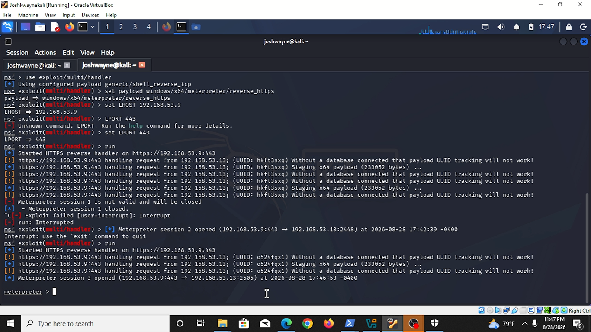
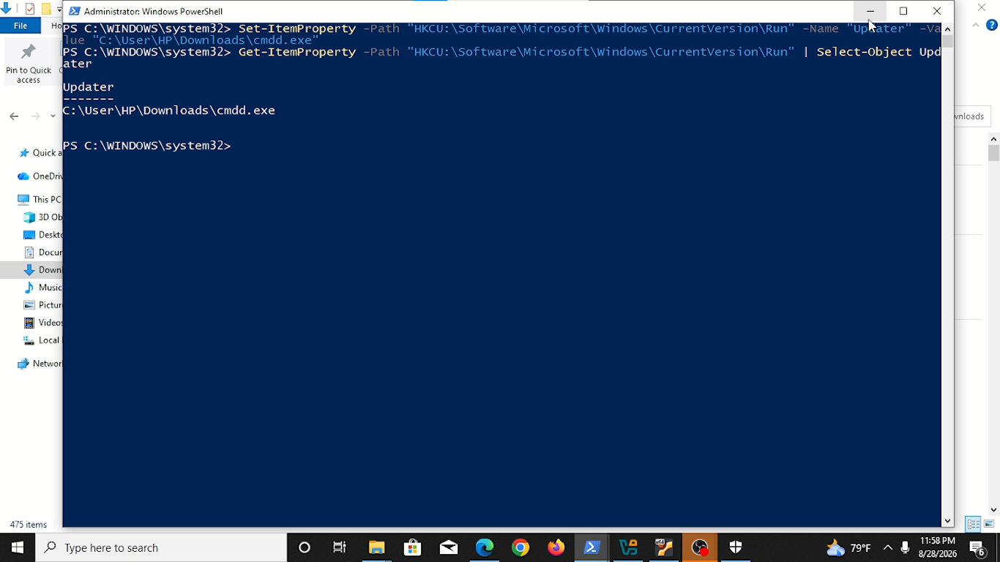

# Detecting-metasploit--payload-on-wazuh-siem
This project is a part of my SOC Analyst home lab
After successfully detecting an RDP brute-force attack, I simulated a more advanced attack chain using **Metasploit**:

- Generated a Windows Meterpreter payload
- Executed it on a Windows endpoint
- Established persistence via Registry Run key
- Detected the entire attack chain using **Wazuh + Sysmon**

The goal was to practice both **red team** techniques and **blue team** detection engineering.

---

## Lab Architecture

| Component | Details |
|------------------------|------------------------------------------|
| **SIEM** | Wazuh Manager on Contabo VPS |
| **Endpoint** | Windows 10/11 with Wazuh Agent + Sysmon |
| **Attacker Machine** | Kali Linux (VirtualBox) |
| **Payload** | `windows/x64/meterpreter/reverse_https` |
| **Persistence** | Registry Run Key (`HKCU\...\Run`) |

---

## Tools Used

- Metasploit Framework
- msfvenom
- Sysmon (SwiftOnSecurity config)
- Wazuh
- Kali Linux
- Windows Registry

---

## Attack Chain

### 1. Payload Generation
Generated a reverse HTTPS Meterpreter payload using `msfvenom`.

### 2. Initial Access
Executed the payload on the Windows endpoint and obtained a Meterpreter session.

### 3. Post-Exploitation
- Performed basic situational awareness (`sysinfo`, `getuid`, `ps`)
- Attempted process migration
- Established persistence

### 4. Persistence Technique
Used the classic **Registry Run Key** method so the payload executes every time the user logs in.

```cmd
reg add "HKCU\Software\Microsoft\Windows\CurrentVersion\Run" /v updater /t REG_SZ /d "C:\path\to\payload.exe" /f
```


Detection with Wazuh + Sysmon
The attack was successfully logged and visible in Wazuh (mainly in the Archives index).

### Key Events Observed

| Activity                    | Sysmon Event ID              | Detected in Wazuh |
|-----------------------------|------------------------------|-------------------|
| Payload Execution           | 1 (Process Create)           | Yes |
| Network Connection to Kali  | 3 (Network Connect)          | Yes |
| Registry Persistence        |  13 (Registry)               | Yes |

Wazuh-Filters
```
data.win.eventdata.image: *cmdd.exe*

agent.name: "DESKTOP-SI9234F" and data.win.system.eventID: 11

agent.name: "DESKTOP-SI9234F" and data.win.system.eventID:13

agent.name: "DESKTOP-SI9234F" and data.win.system.eventID: 3

agent.name: "DESKTOP-SI9234F" and data.win.system.eventID: 1
```

  ## Key Findings
  
###1. Most of the attack activity appeared in wazuh-archives-* rather than wazuh-alerts-*.
###2. This is expected behavior — Archives contain nearly all events, while Alerts only show rule matches.
###3. Sysmon provided excellent visibility into process creation, network connections, and registry modifications.
###4. Default Wazuh rules did not generate high-severity alerts for all stages of the attack (custom rules would improve this).


 ## Lessons Learned
 
###1. Process migration requires sufficient privileges.

###2. Registry Run keys are simple but highly detectable with Sysmon.

###3. Relying only on the Alerts index can cause you to miss important activity — always check Archives during investigations.

###4. Creating custom Wazuh rules is an important next step for better detection.


## Future Improvements

###1. Write custom Wazuh rules for Meterpreter and Registry persistence

###2. Test additional persistence techniques (Scheduled Task, Services, WMI)

###3. Attempt privilege escalation and detect it

###4. Compare detection with Windows Defender enabled vs disabled


## Screenshots





###3. Sysmon Event ID 1, 3, 13

###4. Wazuh Discover views (Archives)


## Disclaimer
This project was conducted in a controlled home lab environment for educational purposes only. All attacks were performed against systems I own.
